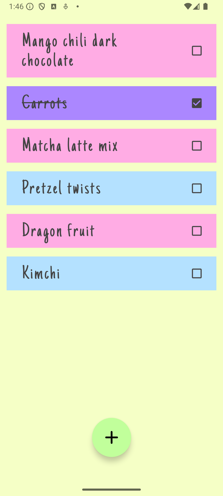
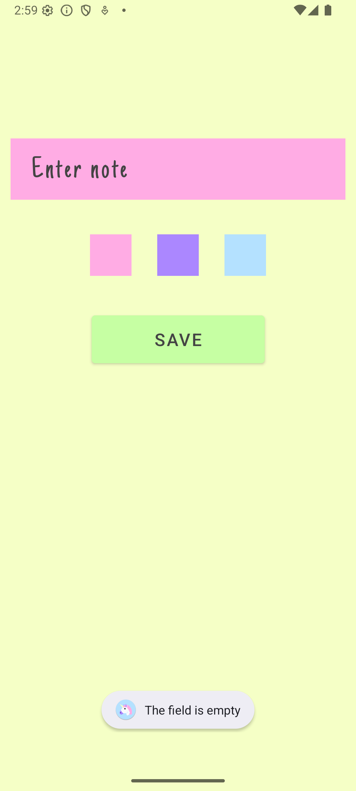
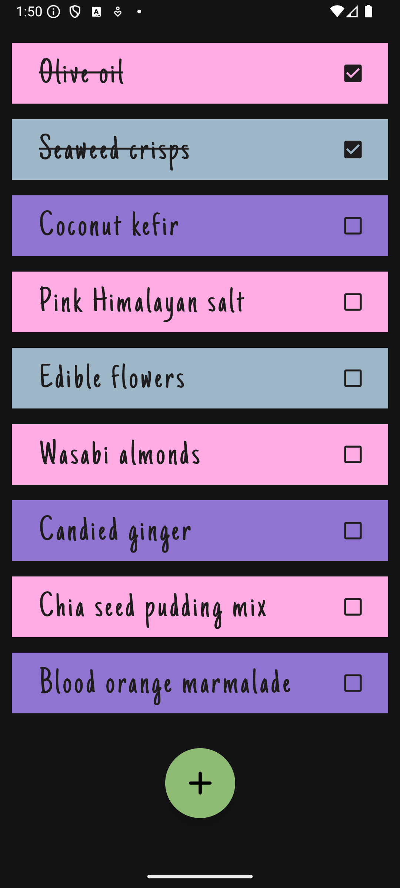
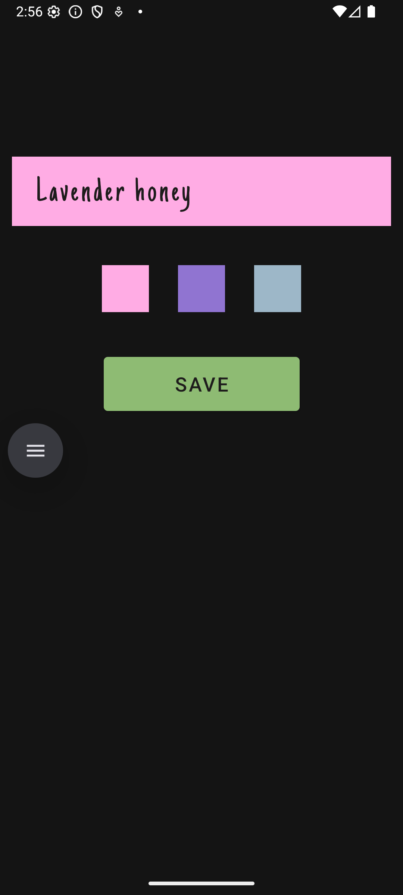

# Unicorn 🦄 – Shopping List App

**Unicorn** is a simple, lightweight app for storing your shopping lists. Add and delete notes in just a few taps. Each note can be highlighted with one of three colors — choose the one that suits you best when saving the note.

The app features a **minimalist and soft design**, making it pleasant to use without overloading the interface. **Unicorn is completely free, contains no ads, and takes up very little space on your device.**


## Features ✨

* Quick and easy shopping list management
* Three color options to organize your notes
* Clean, intuitive, and user-friendly interface
* Small app size
* 100% free with no ads

## About Unicorn

Unicorn is a light and charming solution for your everyday shopping lists. Whether you’re making a quick grocery run or planning your weekly purchases, Unicorn helps you stay organized in a delightful way.

## Screenshots

<table>
  <tr>
    <td></td>
    <td></td>
    <td></td>
    <td></td>
  </tr>
  <tr>
    <td colspan="2" align="center">Light Theme</td>
    <td colspan="2" align="center">Dark Theme</td>
  </tr>
</table>

## Getting Started

1. Clone the repository:

   ```bash
   git clone https://github.com/yourusername/UnicornShoppingList.git
   ```

2. Open the project in **Android Studio**.

3. Build and run the app on your device or emulator.

## Contributing

Contributions are welcome! Feel free to open issues or submit pull requests to improve the app.

## License

This project is open-source.
